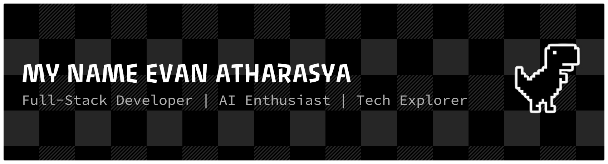

<div align="center">

<!-- Custom Header Banner -->


<!-- Typing Animation -->
<a href="https://git.io/typing-svg">
  
</a>

<!-- Profile Badges -->
<p>
  
  <a href="https://github.com/ESTAS-crypto?tab=followers">
    
  </a>
  <a href="https://github.com/ESTAS-crypto?tab=repositories">
    
  </a>
</p>

<!-- Quick Status Badges -->
<p>
  
  
  
  
</p>

</div>

<!-- Divider -->


##  &nbsp;About Me

```yaml
name: Evan Atharasya
username: ESTAS-crypto
location: Indonesia 🇮🇩
role: Full-Stack Developer & Tech Enthusiast
education: Student Developer

current_focus:
  - 🔭 Building modern web applications & AI-powered tools
  - 🌱 Exploring Next.js, TypeScript & Machine Learning
  - 🤖 Developing automation bots & chatbots
  - 🛒 Creating e-commerce solutions
  - 📊 Financial management systems

interests:
  - Web Development (Frontend & Backend)
  - Artificial Intelligence & Chatbots
  - Crypto & Blockchain Technology
  - Automation & Bot Development
  - UI/UX Design

fun_fact: "I believe every line of code is a step toward innovation 💡"
```

<br/>

<!-- Divider -->


## 🛠️ &nbsp;Tech Stack & Tools

<div align="center">

<!-- Skill Icons Grid -->
<a href="https://skillicons.dev">
  
</a>

<br/><br/>

<a href="https://skillicons.dev">
  
</a>

</div>

<br/>

<div align="center">

### 💻 Languages & Proficiency

| Technology | Level | Proficiency |
|:---:|:---:|:---:|
| JavaScript | ██████████ 95% |  |
| HTML / CSS | ██████████ 95% |  |
| PHP | █████████░ 85% |  |
| Python | ████████░░ 80% |  |
| TypeScript | ███████░░░ 75% |  |

</div>

<br/>

<!-- Expandable Detailed Badges -->
<details>
<summary><b>🔍 View All Tech Badges</b></summary>
<br/>
<div align="center">

**🎨 Frontend**


**⚙️ Backend**


**🗄️ Database & Cloud**


**🔧 DevOps & Tools**


</div>
</details>

<br/>

<!-- Divider -->


## 📊 &nbsp;GitHub Stats

<div align="center">

<!-- Stats & Streak Side by Side -->

<a href="https://github.com/DenverCoder1/github-readme-streak-stats">
  
</a>

<br/><br/>

<!-- Top Languages -->


<br/><br/>

<!-- Profile Details -->


</div>

<br/>

<!-- Contribution Graph -->
<div align="center">
  
</div>

<br/>

<!-- Extra Stats (Expandable) -->
<details>
<summary><b>⚡ More Detailed Analytics</b></summary>
<br/>
<div align="center">


</div>
</details>

<br/>

<!-- Divider -->


## 🏆 &nbsp;GitHub Trophies

<div align="center">
  
</div>

<br/>

<!-- Divider -->


## 🚀 &nbsp;Featured Projects

<div align="center">

| # | Project | Description | Tech |
|:---:|:---|:---|:---:|
| 🌐 | **[portofolio](https://github.com/ESTAS-crypto/portofolio)** | Personal portfolio website with modern UI/UX |  |
| 📝 | **[TRYOUT-SNBT](https://github.com/ESTAS-crypto/TRYOUT-SNBT)** | SNBT exam simulation platform with 340+ questions |  |
| 🛒 | **[GenZMart-PRO](https://github.com/ESTAS-crypto/GenZMart-PRO)** | E-commerce platform for Gen-Z marketplace |  |
| 🤖 | **[nextjs-ai-chatbot](https://github.com/ESTAS-crypto/nextjs-ai-chatbot)** | AI-powered chatbot built with Next.js |  |
| 💡 | **[AI-GRATIS](https://github.com/ESTAS-crypto/AI-GRATIS)** | Free AI tools collection |  |
| 💰 | **[ManajemenKeuangan](https://github.com/ESTAS-crypto/ManajemenKeuangan)** | Financial management system |  |
| 📍 | **[track-location](https://github.com/ESTAS-crypto/track-location)** | Location tracking tool with Python |  |
| 📊 | **[Laporan-ibuk-](https://github.com/ESTAS-crypto/Laporan-ibuk-)** | Report management system |  |

</div>

<br/>

<!-- Divider -->


## 🎮 &nbsp;Contribution Games

### 🐍 Snake Animation
<div align="center">
  <picture>
    <source media="(prefers-color-scheme: dark)" srcset="https://raw.githubusercontent.com/ESTAS-crypto/ESTAS-crypto/output/github-snake-dark.svg" />
    <source media="(prefers-color-scheme: light)" srcset="https://raw.githubusercontent.com/ESTAS-crypto/ESTAS-crypto/output/github-snake.svg" />
    
  </picture>
</div>

<br/>

### 👾 Pac-Man Game
<div align="center">
  <picture>
    <source media="(prefers-color-scheme: dark)" srcset="https://raw.githubusercontent.com/ESTAS-crypto/ESTAS-crypto/output/pacman-contribution-graph-dark.svg" />
    <source media="(prefers-color-scheme: light)" srcset="https://raw.githubusercontent.com/ESTAS-crypto/ESTAS-crypto/output/pacman-contribution-graph.svg" />
    
  </picture>
</div>

<br/>

<!-- Divider -->


## 📬 &nbsp;Connect With Me

<div align="center">
  <a href="https://github.com/ESTAS-crypto">
    
  </a>
  <a href="mailto:evanatharasya@gmail.com">
    
  </a>
  <a href="https://instagram.com/evanatharasya">
    
  </a>
  <a href="https://linkedin.com/in/evanatharasya">
    
  </a>
</div>

<br/>

<!-- Profile Metrics -->
<div align="center">

### 📈 &nbsp;Quick Stats

| 📦 Repositories | 💻 Languages | 📅 Active Since | 🎯 Focus |
|:---:|:---:|:---:|:---:|
| **42+** | **6+** | **2025** | **Full-Stack** |

</div>

<br/>

<!-- Quote -->
<div align="center">
  
</div>

<br/>

<!-- Support CTA -->
<div align="center">
  
### ☕ &nbsp;Support My Work

If you like my projects, consider giving them a ⭐!

<a href="https://github.com/ESTAS-crypto?tab=repositories">
  
</a>
<a href="https://github.com/ESTAS-crypto">
  
</a>

</div>

<br/>

<!-- Footer -->


<div align="center">
  
  
  
</div>
